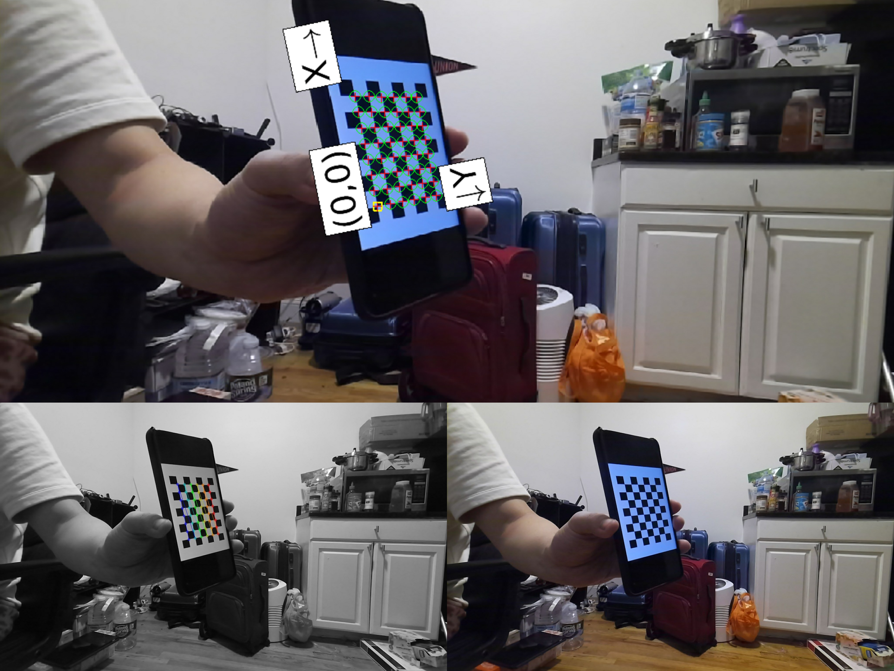

# Camera Calibration Zhang's Method
Do Hyung (Dave) Kwon and Rose Gebhardt for Cooper Union ME458 (Industrial Robotics)
```
# Install
git clone https://github.com/thedavekwon/Camera-Calibration-Zhang-ME458.git
cd Camera-Calibration-Zhang-ME458

# Install Requirements
pip3 install -r requirements.txt

# /data contains sample checkerboard images from Azure Kinect SDK
# /coreners cotnains corners detected from checkerboard images from Azure Kinect SDK

# Usage
python3 src/main.py
```

